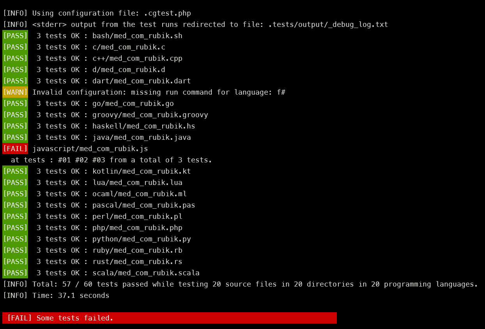

# CGTest v1.0.0

A multi-language offline batch test runner for `CodinGame` solo I/O puzzles.

(c) 2022, by [TBali](https://www.codingame.com/profile/08e6e13d9f7cad047d86ec4d10c777500155033)

## Intro

[CodinGame solo puzzles](https://www.codingame.com/training) provide a fun way to practice and improve your coding skills in any of its [27 supported programming languages](https://www.codingame.com/playgrounds/40701/help-center/languages-versions).

At CG you don't have to bother about setting up any local development environment: just start to write your code directly on the CG website using your browser, run there the provided test cases (for solo puzzles), and submit your solution when you feel ready.

However, sometimes you might want to setup and use your own local dev environment. Having to copy (even with autosync tools) your code to the CG online IDE just to run some tests can be tedious.

__CGTest__ is a simple tool to run tests in batch mode using your local dev and runtime environments. With a single command, you can run hundreds of tests for your code, even if written in __multiple languages__, for __multiple puzzles__, and for __multiple test cases__ per puzzle.

CGTest was successfully used for running `c`, `c++`, `d`, `dart`, `go`, `groovy`, `haskell`, `java`, `kotlin`, `lua`, `pascal`, `perl`, `php`, `python`, `ruby`, `rust` and `scala` tests both in Windows and in Linux; and additionally `bash`, `f#` and `ocaml` in Linux.

The test runner works for any non-interactive code that reads from a standard input and writes the result to the standard output stream. Using it for CodinGame puzzles is only one possible use case.

## Command line usage

```txt
Usage:   php pgtest.php [options] [puzzles]

Options:
   --version          Display CGTest application version
   --help             Display this help message
   --dry-run          Do not run the tests; only show what test cases would run
   --ansi             Use color output [default]
   --no-ansi          Disable color output
   --verbose          Increase the verbosity of messages: also show each passed tests
   --lang-versions    Show versions for all configured programming languages
   --show-defaults    Show default configuration settings (as json)
   --clean            Delete temporary and output files of previous test run
   --config=FILENAME  Use configfile [default: .cgtest.php]
   --lang=LANGUAGES   Run tests in these languages (comma separated list) [default: php; or the list in the config file]

Puzzles:              Space separated list of source filenames (without extension)
                       - if given, it overrides the list in the config file
                       - path can be given, but no wildcards allowed
```

An example run result:



CGTest is a single-file _php_ script, so you need `php` (v7.4 or newer) installed on your machine to use it.

Of course, your code does not need to be in php. Any language can be used for which you have a local dev environment. You might just need to configure how the test runner should invoke your compiler and/or interpreter. _(But there is a high chance that default settings will work for you.)_

## Test cases

The repository already includes some test cases for several `CodinGame` puzzles. Most of these puzzles are rather short and simple. So especially well-suited, if you want to solve some puzzles in __all the CG languages__.

* The input data for these test cases are in `.tests/input` directory.
* The expected test output data for these test cases are in `.tests/expected` directory.
* Running the tests generates output files in the `.tests/output` directory.
* If your code writes also to the error console (maybe some debug info), you can check these in `.tests/output/_debug_log.txt`.
* Rerunning CGTest with the `--clean` option added deletes all temporary and test output files from the previous run.
* You can easily add test cases for other puzzles.
* You can either put your source files in per-language folders or you can structure them in a per-puzzle (or per-puzzle-group) basis.
* You can change the directory structure and the file naming conventions `CGTest` is using out of the box. However, you will need to tweak the config file a bit to your liking.

### Important

Some CG test cases have an expected output with trailing spaces in some lines. __Some code editors remove the trailing whitespaces automatically__, when you open these `.txt` files. This results failing test runs, as your codes output is no longer identical to what is stored in the expected test output file.

__Turn off__ such _false_ autocorrection for `.txt` files. The `.editorconfig` and `.vscode/settings.json` files incéuided this repository already contain the correct settings, other editors might need different actions.

## Configuration file

CGTest includes some sensible defaults for both its global and per-language settings. (You can print it out with the `--show-defaults` command-line option.)

You can override these by using a configuration file. The default configuration file is `.cgtest.php`, or you can provide a different name with the `--config=...` command-line option.

_Note:_ While the configuration file is a valid `php` source code, you don't need to know php at all to use it. It only defines an associative array, very similar to a JSON configuration. All the options are documented with comments in the sample config file.

Some settings (but not all) can be also overriden via command-line arguments. If an option is set both in the config file and via the command-line, then the command-line takes precedence.

_SPOILER ALERT:_ In the repository, there is a solution source code in multiple programming languages for a very simple CG puzzle, called [Rubik](https://www.codingame.com/training/medium/rubik%C2%AE). _If you haven't solved this puzzle yet, do so before checking the sample solutions._

* The sample `.cgtest.php` runs test cases for these solutions in several languages, assuming you have the local runtimes installed.
* If you don't have the local setup for a language, just comment it out in the `'languages'` section of config file, or override the language selection with the `--lang=` command-line option.
* There is an additional sample configuration file `.cgtest.full.php`. This has references all the provided test cases in a per-language `'includePuzzles'` section. Use this config with the `--config=.cgtest.full.php` command-line option.

## Restrictions

_CGTest_ supports only solo I/O puzzles. For any test case, the input must be a fixed file (so a given line of input cannot depend on the output previously provided by the code). This means that some solo and optim puzzles cannot be tested. Bot programming is also out of question.

## Issues

I don't have local dev environment for all the 27 languages Codingame supports. Therefore, some of the languages default settings are not properly set up. You need to create a section for these languages in the config file.

If you have experience in how to set up any of the other languages, please send a message, or give a Pull Request (for example with a config file with proper command-line syntax).

* I could not yet set up to run the tester properly for: `c#`, `vb.net`, `clojure`, `objective-c`, `swift`
* `javascript` and `typescript` code is run by `node`, however the `readline()` function is missing. I don't know how to properly polyfill this locally.
* Running `bash` script works in WSL or in Linux, but I ran into issues with vanilla Windows using a _'bash for Windows'_ package such as `MSYS2`.

## License

CGTest is open-sourced software licensed under the [MIT license](https://opensource.org/licenses/MIT).
