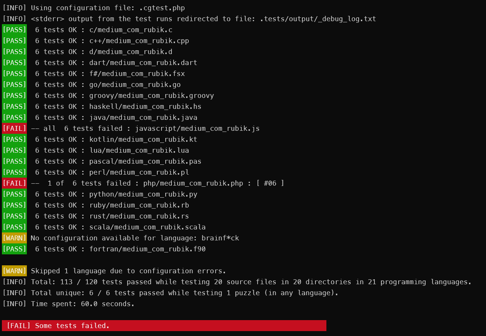
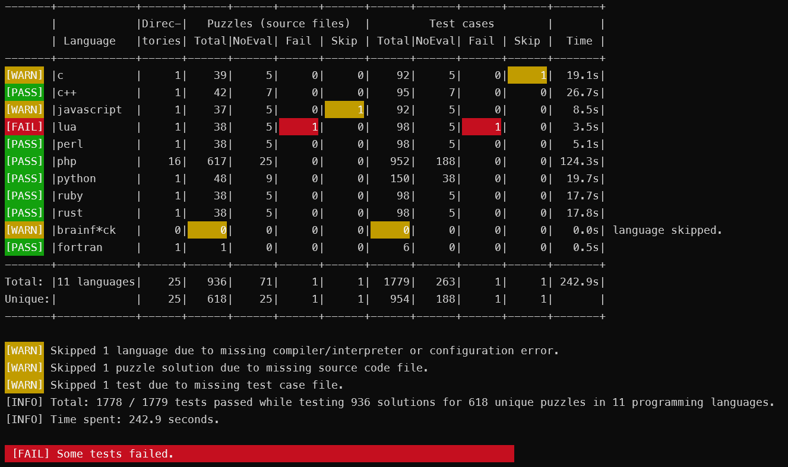

# CGTest


A multi-language offline batch test runner for `CodinGame` (or other) solo I/O puzzles.

(c) 2023, by Bálint Tóth ([TBali](https://www.codingame.com/profile/08e6e13d9f7cad047d86ec4d10c777500155033))

## Intro

__CGTest__ is a simple command-line tool to run tests in batch mode using your local dev and runtime environments. With a single command, you can run hundreds of tests for your code, even if written in __multiple languages__, for __multiple puzzles__ (or projects), and for __multiple test cases__ per puzzle.

CGTest was successfully used for running `c`, `c#`, `c++`, `d`, `dart`, `f#`, `fortran`, `go`, `groovy`, `haskell`, `java`, `javascript`, `kotlin`, `lua`, `pascal`, `perl`, `php`, `python`, `ruby`, `rust`, `scala`, `typescript` and `vb.net` tests both on Windows and on Linux, and additionally `bash` and `ocaml` on Linux. It should also work on almost any other computer system, including Mac.

The test runner works for any non-interactive code that reads from a standard input stream, and writes the result to the standard output stream. Using it for CodinGame puzzles is only one possible use case.

### Using with CodinGame

[CodinGame solo puzzles](https://www.codingame.com/training) provide a fun way to practice and improve your coding skills in any of its [27 supported programming languages](https://www.codingame.com/playgrounds/40701/help-center/languages-versions).

At CG, you don't have to bother about setting up any local development environment: just start to write your code directly on the CG website using your browser, run there the provided test cases (for solo puzzles), and submit your solution when you feel ready.

However, sometimes you might want to setup and use your own local dev environment. Having to copy (even with autosync tools) your code to the CG online IDE just to run some tests can be tedious.

_The repository also contains __2900+__ test cases for __740+__ `CodinGame` puzzles._

## Command line usage

```txt
Usage:   php cgtest.php [options] [puzzles]

Options:
   --version          Display CGTest application version
   --help             Display this help message
   --dry-run          Do not run the tests; only show what test cases would run
   --run-only         Run the tests, but do not evaluate results
   --ansi             Use color output [default]
   --no-ansi          Disable color output
   --verbose          Increase the verbosity of messages: also show each passed tests
   --stats            Show per-language test stats
   --lang-versions    Show versions for all configured programming languages
   --show-defaults    Show default configuration settings (as json)
   --clean            Delete temporary and output files of previous test run
   --create=COUNT     Create COUNT number of empty test cases for the given puzzle
   --config=FILENAME  Use configfile [default: .cgtest.php]
   --test-case=id     Run only a specific test case [default: all]
   --lang=LANGUAGES   Run tests in these languages (comma separated list)
                        - default: php; or the languages section in the config file

Puzzles:              Space separated list of source filenames (WITHOUT extension)
                        - if given, it overrides the list in the config file
                        - path can be given, but no wildcards allowed
                        - if no path given, then per-language path setting is taken from the config file
```

The minimal required configuration to run CGTest is to define (either via command-line or via the config file) the list of puzzles to test, and the list of languages to run.

### Typical output

CGTest shows the list of failed tests and a summary:


With the `--verbose` option, all tested source files listed, even if passing:



The `--stats` option is useful if you run the test for multiple languages:



_Note: The spent time shown includes the time of compiling, not just the time spent in your source code._

## Prerequisites


CGTest is a single-file php script, so you need `PHP` (v7.3 or newer) installed on your machine to use it. (PHP is very easy to install on Windows or Mac, and comes already pre-installed on most Linux distributions.)

* If you are unfamiliar with setting up php, [this section on my tech.io article about php dev tools](https://www.codingame.com/playgrounds/77580/php-dev-tools-for-codingame-or-elsewhere/running-your-code-locally-php) might provide some help.

Of course, your code does not need to be written in php. _Any language can be used_, for which you have a local dev environment. You might just need to configure how the test runner should invoke your compiler and/or interpreter. _(But there is a high chance that default settings, provided for ~30 languages will also work for you.)_

## Configuration file

CGTest includes some sensible defaults for both its global and per-language settings. (You can print it out with the `--show-defaults` command-line option.)

You can override these by using a configuration file. The default configuration file is `.cgtest.php`, or you can provide a different name with the `--config=...` command-line option.

_Note: While the configuration file is a valid `php` source code, you don't need to know php at all to use it. It only defines an associative array, very similar to a JSON configuration. All the options are documented with comments in the sample config file._

Some settings (but not all) can be also overriden via command-line arguments. If an option is set both in the config file and via the command-line, then the command-line takes precedence.

## Preparing and running test cases

* By default, the input data for the test cases is in the `.tests/input` directory.
    * Naming convention: `puzzleName_iXX.txt`, where XX is the two-digit test case number, starting from 01.
* The expected test output data is in the `.tests/expected` directory.
    * Naming convention: `puzzleName_eXX.txt`, where XX is test case number.
* You can use the `--create` command line argument to quickly generate empty test case files, to be edited later.
* Running the tests generates output files in the `.tests/output` directory.
    * Naming convention: `puzzleName_oXX_languageName.txt`, where XX is test case number.
* If your code writes also to the error console (maybe some debug info), you can check these in `.tests/output/_debug_log.txt`.
* Compiled languages generate temporary build files in the `.tests/temp` directory.
* Rerunning CGTest with the `--clean` option added deletes all temporary and test output files from the previous run. (The puzzle and language selection rules in effect still apply.)
    * Besides the test run output, CGTest will delete the files defined in the per-language `'cleanPatterns'` configuration section. If you override the defaults, be extra careful with the file pattern, not to accidentaly delete something in your system.
* You can either put your source files in _per-language_ directories, or you can structure them in a _per-puzzle (or per-puzzle-group)_ basis.
    * By default, all source code is expected to be in the respective `languageName/` directory, with the same name as the beginning of the test case input data file name.
    * If using _per-puzzle_ directories for the test cases, you must set the per-language `'sourcePath'` setting to `''` in the config file.)
* If not provided via command-line, list the puzzle names in the config file either in the global `'puzzles'` section, or in a per-language `'includePuzzles'` list. If you have solution for a puzzle in most (but not all) languages, you can list it in the global puzzles section, but also add it to the per-language `'excludePuzzles'` lists for languages that you lack the solution.  
* You can also add a puzzle to a per-language `'runOnlyPuzzles'` list in the config file. These puzzles will be built and run, but the tests will always pass, without evaluating the test results. This is useful to run some _optimization_ and _multi-turn_ puzzles on CodinGame.
* You can change the directory structure and the file naming conventions that `CGTest` is using out of the box. However, you will need to tweak the config file a bit to your liking. For more details, check out the comments in the sample config file.

### Important

Some CG test cases have an expected output with trailing spaces in some lines. _Some code editors remove the trailing whitespaces automatically_, when you open these `.txt` files. This results failing test runs, as your codes output is no longer identical to what is stored in the expected test output file.

_Turn off_ such _false_ autocorrection for `.txt` files. The `.editorconfig` and `.vscode/settings.json` files included in this repository already contain the correct settings, other editors might need different actions.

### Sample test cases

The repository also includes some test cases for many `CodinGame` puzzles.

___SPOILER ALERT:___ In the repository, there are solution source code files in multiple programming languages for a very simple CG puzzle, called [Rubik](https://www.codingame.com/training/medium/rubik%C2%AE). _If you haven't solved this puzzle yet, do so before checking the sample solutions._

* The sample `.cgtest.php` runs test cases for the solutions for this single puzzle in several languages, assuming you have the local compilers or runtimes installed.
    * If you don't have the local setup for a language, just comment it out in the `'languages'` section of config file, or override the language selection with the `--lang=` command-line option.
* There is an additional sample configuration file `.cgtest.full.php`.
    * Use this config with the `--config=.cgtest.full.php` command-line option.
    * This has references to ALL the test cases included in the CGTest repository.
    * Some puzzles are listed in the global `'puzzles'` or `'runOnlyPuzzles'` sections. These are the shortest and simplest puzzles, so they are especially well-suited if you want to solve some puzzles in __all the CG-supported languages__.
    * Other puzzles are listed in a per-language `'includePuzzles'` or `'runOnlyPuzzles'` section. Modify the language and comment out the puzzle names as needed.
    * For most easy and medium community puzzles only a single test case is provided. That is OK for a simple smoke-test, but not enough to prove that your solution is really correct. Hard and expert puzzles are better covered.

## Restrictions

* _CGTest_ supports only solo I/O puzzles. For any test case, the input must be a fixed file (so a given line of input cannot depend on the output previously provided by the code). This means that some solo and optim puzzles cannot be tested. Bot programming is also out of question.
    * You can still run these puzzles (without evaluating the test result) based on the _turn #0_ input data, however, your code must be modified for offline use to avoid running out of input or being in an endless loop.

* CGTest is a single thread application, so tests are running in sequence, which can be rather slow if you have lots of test cases. If you start CGTest multiple times concurrently, use separate configuration files, with different output directory settings.

* CGTest does not use containers or any other environment separation when running your tests. If your code does silly things, like deleting files, then CGTest will NOT prevent it doing the damage.

* Building `C#` or `VB.NET` source code generates lots of files in the `.tests/temp/bin` and `.tests/temp/obj` directories. CGTest does not delete these directories with the `--clean` command-line option.

## Known issues

I don't have local dev environment for all the 27 languages Codingame supports. Therefore, some of the languages default settings are not properly set up. You need to create a section for these languages in the config file.

* I could not yet set up to run the tester properly for: `clojure`, `objective-c`, `swift`
* Running `bash` script works in WSL or in Linux, but I ran into issues with vanilla Windows using a _'bash for Windows'_ package such as `MSYS2`.

_If you have experience in how to set up any of the other languages, please send a message, or give a Pull Request (for example with a config file with proper command-line syntax)._

## License

CGTest is open-sourced software licensed under the [MIT license](https://opensource.org/licenses/MIT).
